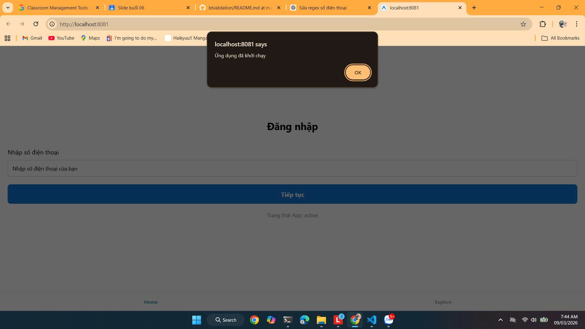
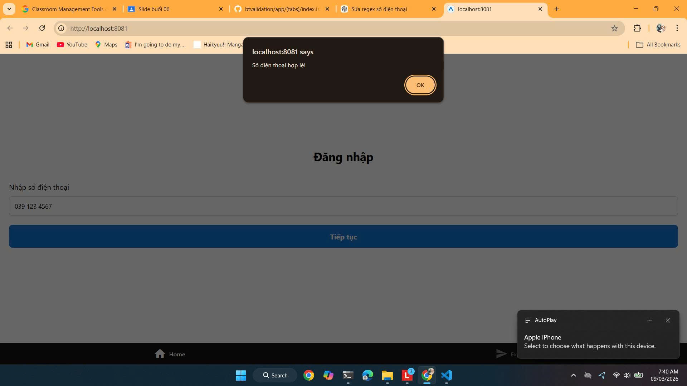

# Thực hành validation

## Thông tin sinh viên
- Họ và tên: nguyễn văn an
- Mã sinh viên: 23810310355

## Mô tả bài tập
Sử dụng màn hình SignIn đã thiết kế giao diện ở bài 2. Bổ sung chức năng validation theo yêu cầu.
- Sau khi người dùng nhập số điện thoại và nhần "Tiếp tục" => Kiểm tra xem số điện thoại có đúng định dạng không và thông báo bằng popup lên màn hình

## Hình ảnh kết quả chạy ứng dụng

 
 

